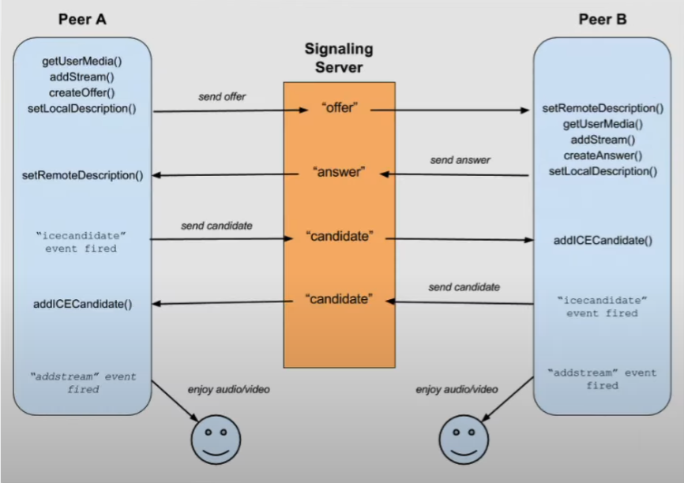

## Zoom_clone_coding

This is Zoom clone coding repository.

- Lecture by Nomad Coders

 

- Lecture : 줌 클론 코딩

 

- Link : https://nomadcoders.co/

 

### 사전 지식

- Express
- Pug
- app.get()
- (req,res)
- Nodemon : 프로젝트를 살펴보고 변경사항이 있을 시 서버를 재시작해주는 프로그램
- Babel : 작성한 코드를 일반 Node.js 코드로 컴파일
- MVP CSS
- Socket.io => WebSocket의 부가기능이 아닌 WebSocket도 활용하여 다양한 프로토콜을 이용한 실시간 클라이언트 서비스 구현을 도와주는 프레임워크 혹은 라이브러리이다. => 즉, 단순 WebSocket의 확장이 아님
  - 또한 Socket.io를 이용하면 기존의 소켓통신을 더욱 간편하게 할 수 있고, 굉장히 탄력적이여서 WebSocket 연결이 끊어지더라도 연결을 유지하는 다른 대안책도 존재한다.
  - 프론트(브라우저)와 백엔드 모두에서 설치(추가)해야 한다.
     

### 서버 설정(server.js)

- Pug로 view Engine 설정
- Express에 template이 어디 있는지 지정
- public url을 생성해서 유저에게 파일을 공유
- home.pug를 render 해주는 route handler 를 만듬

 

### 결과물

---

---

#### 구현 기능

- ***

#### 번외

- 외부 모바일에서도 접속할 수 있도록 해보기

1. npm i localtunnel => 내 서버를 전세계와 공유할 수 있게 해줌 => 항시 무료가 아님 일시적 무료임
2. npm i -g localtunnel

3. lt --port 3000

---

#### 번외 2

- 문제가 생김 내 컴퓨터랑 폰이 같은 wifi에 있지 않으면 에러가 발생함
- STUN 서버라는 것이 필요하다
- STUN서버는 컴퓨터가 공용 IP를 찾게 해준다.
- 즉 서로 다른 네트워크를 사용하고 싶다면 STUN서버를 통해 공용 IP를 얻어야함

---
